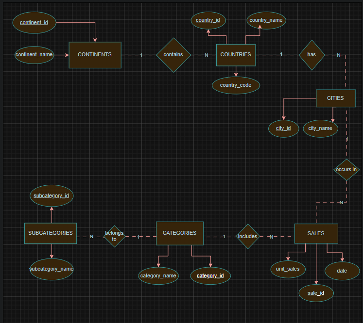
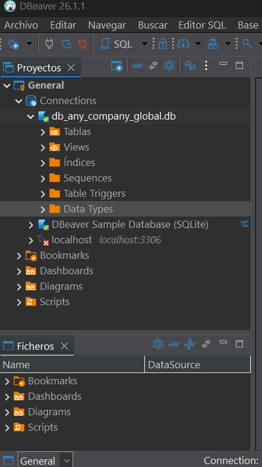
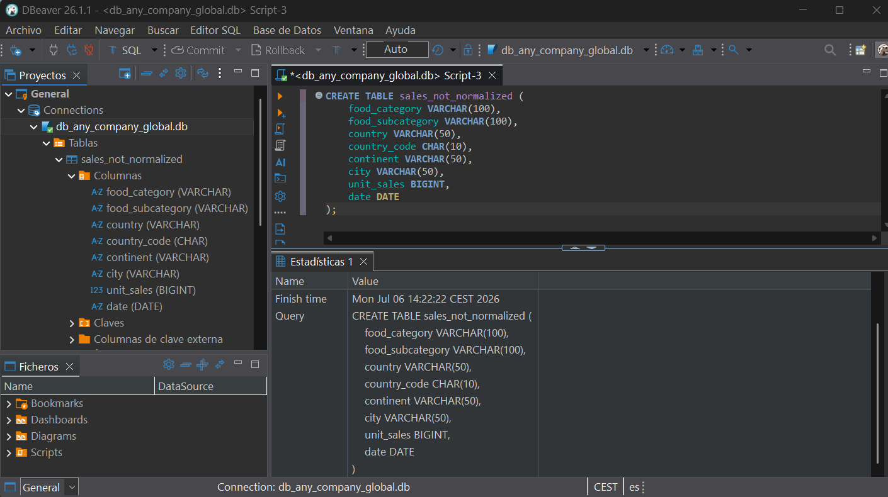
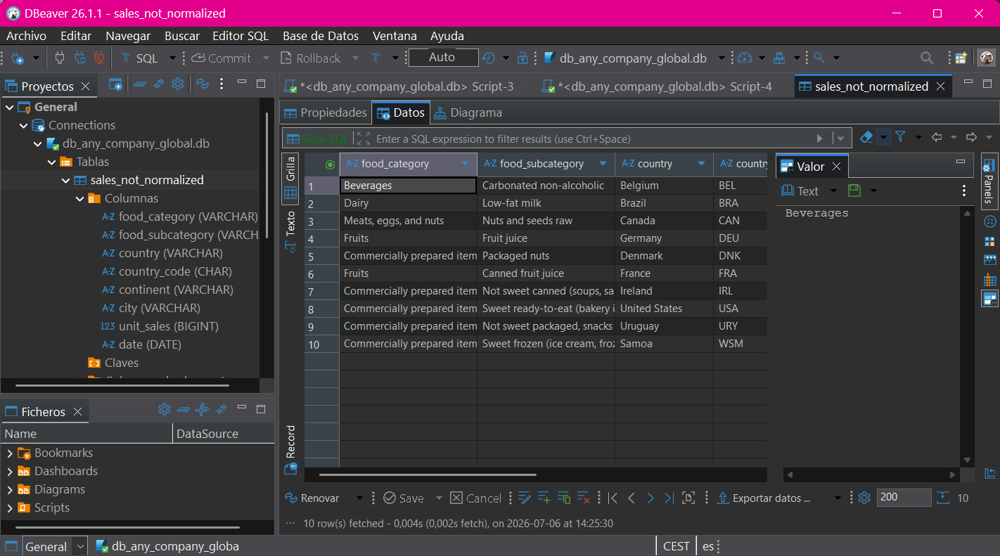
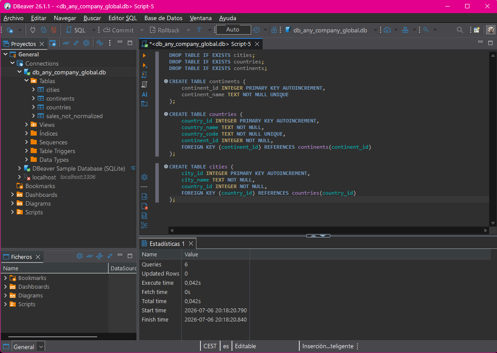
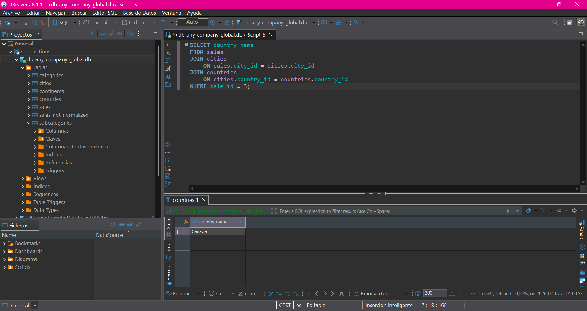

<div align="center">

# SQLite Database Normalization

Database normalization project developed during the **Full Stack Java Bootcamp**.

<br>


<br><br>

[](https://skillicons.dev)

</div>

---

# Project Information

| Property | Value |
|-----------|-------|
| **Project** | SQLite Database Normalization |
| **Version** | 1.0.0 |
| **Status** | 🚧 In Progress |
| **Bootcamp** | Full Stack Java |
| **Repository Type** | Academic Project |
| **Database** | SQLite |
| **Maintainer** | Ruddy P. Cruz Campoverde |

---

# Tech Stack

| Technology | Purpose |
|------------|---------|
| [](https://skillicons.dev) SQLite | Relational database |
| DBeaver | Database management |
| [](https://skillicons.dev) Git | Version control |
| [](https://skillicons.dev) GitHub | Source code hosting |
| [](https://skillicons.dev) Visual Studio Code | Development environment |
| diagrams.net | Database diagram design |

---

# Summary

- [Overview](#overview)
- [Objectives](#objectives)
- [Project Structure](#project-structure)
- [Database Design](#database-design)
- [Implementation](#implementation)
- [Project Evidence](#project-evidence)
- [Learning Outcomes](#learning-outcomes)
- [Author](#author)

---

# Overview

### 🇬🇧 English

This project started with a single table containing product, sales and location data all mixed together. The goal was to reorganize that information into a normalized database where every table has a clear purpose and every relationship makes sense.

At first it looked like creating more tables would only make things more complicated. After finishing the normalization process, it became clear that the real problem was trying to keep everything inside one table.

### 🇪🇸 Español

Este proyecto comenzó con una única tabla donde se mezclaban datos de productos, ventas y ubicaciones. El objetivo fue reorganizar toda esa información en una base de datos normalizada, donde cada tabla tuviera una función concreta y las relaciones entre ellas fueran claras.

Al principio parecía que crear más tablas solo iba a complicar las cosas. Al terminar la normalización quedó claro que el verdadero problema era intentar guardar toda la información en una sola tabla.

---

# Objectives

| ID | Description | Status |
|----|-------------|:------:|
| OBJ-01 | Create SQLite database | ✓ |
| OBJ-02 | Execute provided SQL scripts | ✓ |
| OBJ-03 | Analyze non-normalized table | ✓ |
| OBJ-04 | Normalize database | ✓ |
| OBJ-05 | Create Chen diagram | ✓ |
| OBJ-06 | Create Crow's Foot diagram | ⏳ |
| OBJ-07 | Create SQL query | ✓ |
| OBJ-08 | Complete project documentation | ⏳ |

---

# Project Structure

```text
database-normalization-sqlite
├── database
│   └── db_any_company_global.db
├── diagrams
│   └── image-diagram.png
├── README.md
├── screenshots
│   ├── create-table.png
│   ├── normalization-tables.png
│   ├── query-sale-country.png
│   ├── sample-data.png
│   └── sql-database.png
└── sql
    ├── any_company_global_create_table_script.sql
    ├── any_company_global_insert_data_script.sql
    ├── normalization.sql
    ├── populate_normalized_tables.sql
    └── query_sale_country.sql
```

---

# Database Design

## Initial Analysis

### 🇬🇧 English

Before changing anything, I took a look at the original table to understand what kind of information it contained. It quickly became obvious that products, locations and sales were all stored together, which meant the same values appeared again and again.

From that first analysis, three main groups of information could be identified:

- Product information
- Geographic information
- Sales information

This became the starting point for designing the normalized database.

### 🇪🇸 Español

Antes de modificar nada, revisé la tabla original para entender qué tipo de información almacenaba. Rápidamente se podía ver que productos, ubicaciones y ventas estaban mezclados en la misma tabla, haciendo que muchos datos se repitieran continuamente.

A partir de ese análisis fue posible identificar tres grandes grupos de información:

- Información de productos
- Información geográfica
- Información de ventas

Ese fue el punto de partida para diseñar la base de datos normalizada.

---

## Chen Entity-Relationship Diagram

### 🇬🇧 English

Before creating the new tables in SQLite, I designed a Chen Entity-Relationship diagram. It helped me organise the entities, identify their attributes and check that every relationship made sense before writing the SQL.

Having a clear design first saved a lot of time later.

### 🇪🇸 Español

Antes de crear las nuevas tablas en SQLite diseñé un diagrama Entidad-Relación de Chen. Me sirvió para organizar las entidades, identificar sus atributos y comprobar que todas las relaciones tenían sentido antes de empezar a escribir el SQL.

Tener el diseño claro desde el principio hizo que el resto del proceso fuera mucho más sencillo.



---

# Implementation

### 🇬🇧 English

Once the design was ready, the database was built step by step.

Instead of trying to normalize everything at once, I created each table individually, added the relationships between them and finally migrated the data from the original table into the new structure.

Following this order made it much easier to detect mistakes and verify that every relationship worked correctly before moving on.

Main implementation steps:

- Create the normalized tables.
- Define primary and foreign keys.
- Populate the new tables.
- Verify the relationships using SQL queries.

### 🇪🇸 Español

Una vez terminado el diseño, la implementación se realizó paso a paso.

En lugar de intentar normalizar toda la base de datos de una sola vez, fui creando cada tabla por separado, añadiendo las relaciones entre ellas y, por último, migrando la información desde la tabla original hacia la nueva estructura.

Seguir este orden hizo mucho más fácil detectar errores y comprobar que todas las relaciones funcionaban correctamente antes de continuar.

Principales pasos de implementación:

- Crear las tablas normalizadas.
- Definir las claves primarias y foráneas.
- Poblar las nuevas tablas.
- Verificar las relaciones mediante consultas SQL.

---

# Project Evidence

This section contains the main milestones completed during the project, together with screenshots showing the progress from the original database to the normalized model.

Esta sección recoge las principales fases completadas durante el proyecto, junto con capturas que muestran la evolución desde la base de datos original hasta el modelo normalizado.

---

## SQLite Database

### 🇬🇧 English

The project started by creating the SQLite database and importing the SQL scripts provided for the exercise.

### 🇪🇸 Español

El proyecto comenzó creando la base de datos SQLite e importando los scripts SQL proporcionados para la práctica.



---

## Original Table

### 🇬🇧 English

After executing the scripts, the `sales_not_normalized` table was created successfully.

### 🇪🇸 Español

Después de ejecutar los scripts se creó correctamente la tabla `sales_not_normalized`.



---

## Sample Data

### 🇬🇧 English

The sample data was imported successfully and became the starting point for the normalization process.

### 🇪🇸 Español

Los datos de ejemplo se importaron correctamente y sirvieron como punto de partida para el proceso de normalización.



---


## Chen Entity-Relationship Diagram

### 🇬🇧 English

Before implementing the database, the conceptual model was represented using Chen notation to validate the entities and their relationships.

### 🇪🇸 Español

Antes de implementar la base de datos, el modelo conceptual se representó mediante la notación de Chen para validar las entidades y sus relaciones.


---

## Normalized Database

### 🇬🇧 English

After identifying the entities and their relationships, the original table was transformed into a normalized relational model.

Seeing six tables instead of one looked strange at first, but by this point it was easy to understand why each one had its own responsibility.

### 🇪🇸 Español

Tras identificar las entidades y sus relaciones, la tabla original se transformó en un modelo relacional normalizado.

Ver seis tablas en lugar de una llamó la atención al principio, pero en este punto ya era fácil entender por qué cada una tenía una responsabilidad diferente.




---

## SQL Query

### 🇬🇧 English

The final query checks that the relationships between the normalized tables work correctly by retrieving the country where sale **ID 3** was made.

### 🇪🇸 Español

La consulta final comprueba que las relaciones entre las tablas normalizadas funcionan correctamente obteniendo el país donde se realizó la venta con **ID 3**.

```sql
SELECT country_name
FROM sales
JOIN cities
    ON sales.city_id = cities.city_id
JOIN countries
    ON cities.country_id = countries.country_id
WHERE sale_id = 3;
```



---
# Learning Outcomes

### 🇬🇧 English

This project helped me understand that database normalization is much easier to learn by building it than by only reading about it.

Working through the exercise step by step also helped me become more comfortable with designing relational databases before writing SQL.

Some of the concepts I reinforced during this project were:

- Database normalization (1NF, 2NF and 3NF).
- Primary and foreign keys.
- Entity relationships.
- Chen Entity-Relationship diagrams.
- SQL JOIN operations.
- Relational database design.

The biggest lesson was discovering that adding more tables does not necessarily make a database more complicated. If the design is correct, it actually becomes much easier to understand and maintain.

### 🇪🇸 Español

Este proyecto me ayudó a entender que la normalización se aprende mucho mejor haciéndola que simplemente estudiando la teoría.

Ir resolviendo el ejercicio paso a paso también me permitió sentirme más cómodo diseñando una base de datos relacional antes de empezar a escribir SQL.

Algunos de los conceptos que reforcé durante este proyecto fueron:

- Normalización de bases de datos (1FN, 2FN y 3FN).
- Claves primarias y foráneas.
- Relaciones entre entidades.
- Diagramas Entidad-Relación de Chen.
- Consultas SQL utilizando JOIN.
- Diseño de bases de datos relacionales.

La mayor lección fue descubrir que añadir más tablas no significa complicar una base de datos. Si el diseño está bien planteado, ocurre justo lo contrario: todo resulta mucho más sencillo de entender y mantener.

---

# Next Steps

### 🇬🇧 English

The remaining work focuses on completing the Crow's Foot diagram, reviewing the documentation and polishing the project before its final delivery.

### 🇪🇸 Español

El trabajo pendiente consiste en completar el diagrama Crow's Foot, revisar toda la documentación y dar los últimos retoques al proyecto antes de su entrega final.

---

# Author

| Name | GitHub |
|------|--------|
| **Ruddy P. Cruz Campoverde** | [@ruddycruzc](https://github.com/ruddycruzc) |

---

# Developer's Note
<div align="center">

**Thanks for visiting this repository.**

---

> **🇬🇧 English**
>
> ***Things I learned during this project:***
> - Normalization is less scary than it sounds.
> - SQL JOINs eventually stop looking like magic.
>
>***Behind this repository there are:***
> - More coffees than SQL scripts.
> - A few Git branches that probably didn't need to exist.
> - One merge conflict caused entirely by me.
> - Several "this should work..." moments.
> - One database that finally made sense.
>Looking back, I probably spent more time arguing with Git than with SQLite, but somehow both ended up behaving.*
---
>***🇪🇸 Español***
>
> ***Cosas que aprendí durante este proyecto:***
> - La normalización da menos miedo del que parece.
> - Los JOIN dejan de parecer magia después de hacer unos cuantos.
>
>***Detrás de este repositorio hay:***
> - Más cafés que scripts SQL.
> - Unas cuantas ramas de Git que probablemente nunca hicieron falta.
> - Un conflicto de merge provocado íntegramente por mí.
> - Bastantes momentos de "esto debería funcionar...".
> - Y una base de datos que, por fin, terminó teniendo sentido.
>Mirándolo ahora con perspectiva, creo que discutí más con Git que con SQLite, aunque al final los dos acabaron portándose bien.